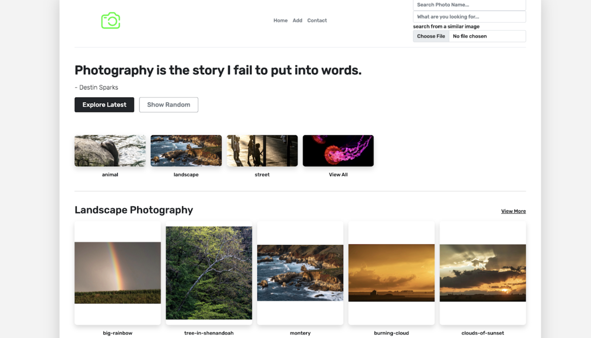
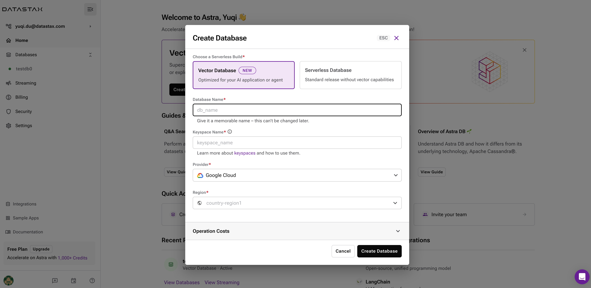

# Photography Site

This sample app demonstrates a photography site by using [Astra Vector DB](https://www.datastax.com/guides/what-is-a-vector-database), [JSON API](https://github.com/stargate/jsonapi), [stargate-mongoose](https://github.com/stargate/stargate-mongoose), [express](https://expressjs.com/).

App blog is in [medium](https://medium.com/building-the-open-data-stack/build-a-text-and-image-search-app-with-astra-db-vector-search-nodejs-stargates-new-json-api-and-3097dcf12bbf), [dzone](https://dzone.com/articles/build-text-and-image-search-nodejs-ai-app-with-ast).



## 📋 How to

- [01. Create Astra Account](#-1---create-your-datastax-astra-account)
- [02. Create Astra Token](#-2---create-an-astra-token)
- [03. Create a Database](#-3---create-a-database)
- [04. Register to OpenAI](#-4---register-to-openai)
- [05. Setup Project](#-5---setup-project)
- [06. Run the project](#-6---run-the-project)


#### ✅ `1` - Create your DataStax Astra account

> ℹ️ Account creation tutorial is available in [awesome astra](https://awesome-astra.github.io/docs/pages/astra/create-account/)

_click the image below or go to [https://astra.datastax./com](bit.ly/3QxhO6t)_

<a href="bit.ly/3QxhO6t">

</a>


#### ✅ `2` - Create an Astra Token

> ℹ️ Token creation tutorial is available in [awesome astra](https://awesome-astra.github.io/docs/pages/astra/create-token/#c-procedure)

- `Locate ` Settings ` (#1) in the menu on the left, then `Token Management` (#2)

- Select the role `Organization Administrator` before clicking `[Generate Token]`


The Token is in fact three separate strings: a `Client ID`, a `Client Secret` and the `token` proper. You will need some of these strings to access the database, depending on the type of access you plan. Although the Client ID, strictly speaking, is not a secret, you should regard this whole object as a secret and make sure not to share it inadvertently (e.g. committing it to a Git repository) as it grants access to your databases.

```json
{
  "ClientId": "ROkiiDZdvPOvHRSgoZtyAapp",
  "ClientSecret": "fakedfaked",
  "Token":"AstraCS:fake"
}
```

#### ✅ `3` - Create a Database

If you are creating a new account, you will be brought to the DB-creation form directly.

Otherwise, get to the databases dashboard (by clicking on Databases in the left-hand navigation bar, expanding it if necessary), and click the `[Create Database]` button on the right.




Take a moment to fill the form:

- **ℹ️ Fields Description**

| Field                                      | Description                                                                                                                                                                                                                                    |
|--------------------------------------------|------------------------------------------------------------------------------------------------------------------------------------------------------------------------------------------------------------------------------------------------|
| **Vector Database vs Serverless Database** | `PICK VECTOR` In june 2023, Cassandra introduced the support of vector search to enable Generative AI use cases. You might consume your credit faster with a vector database.                                                                                |
| **database name**                          | It does not need to be unique, is not used to initialize a connection, and is only a label (keep it between 2 and 50 characters). It is recommended to have a database for each of your applications. The free tier is limited to 5 databases. |
| **keyspace**                               | `photography`                                                                     |
| **Cloud Provider**                         | Choose whatever you like. Click a cloud provider logo, pick an Area in the list and finally pick a region. We recommend choosing a region that is closest to you to reduce latency. In free tier, there is very little difference.             |


#### ✅ `4` - Register to OpenAI

- Access to [OpenAI platform](https://platform.openai.com/) and register.


- In your profile, go to `View API KEYS`, create a new key and copy the value in your clipboard. 
You have a free trial for a month of so.


#### ✅ `5` - Setup project

detailed instructions in [Photography App README](photography-site-demo.js/readme.md)

- **Setting up .env file to run against AstraDB**

1. Copy the `.env.example` file to `.env` and fill in the values for the environment variables.
2. Set `IS_ASTRA` to `true`
3. Set `OPENAI_API_KEY` to your openAI api key
4. Set `ASTRA_DBID` to your AstraDB vector database ID
5. Set `ASTRA_REGION` to your AstraDB vector database region
6. Set `ASTRA_KEYSPACE` to your AstraDB vector database keyspace (should be 'photography')
7. Set `ASTRA_APPLICATION_TOKEN` to your AstraDB application token

#### ✅ `6` - Run the project

detailed instructions in [Photography App README](photography-site-demo.js/readme.md)


- **Install Python and google-mediapipe**

Make sure you have a local python (3.8 - 3.11) environment and install [google-mediapipe](https://developers.google.com/mediapipe/solutions/guide) 

```console
pip install mediapipe
```

- **Make sure you have Node.js 17 or higher**

```
node --version
```

- **Build the application**

```
npm install
```

- **Populate the database**

```
npm run seed
```


- Start the application  

```
npm start
```

- Visit `http://127.0.0.1:3000` to see the UI


