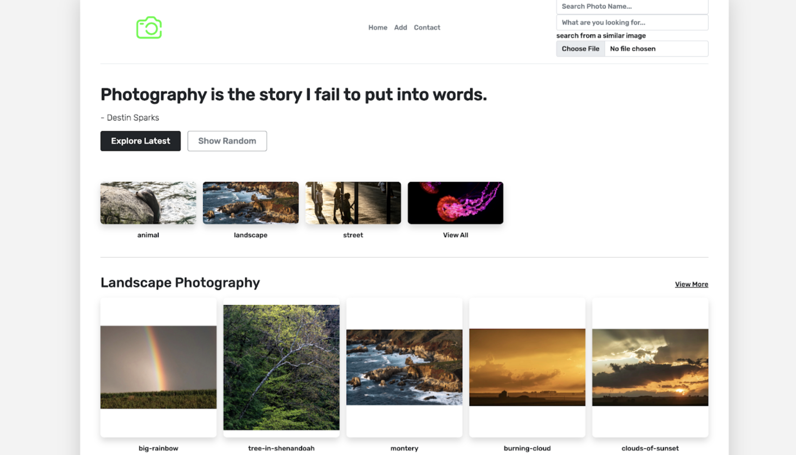
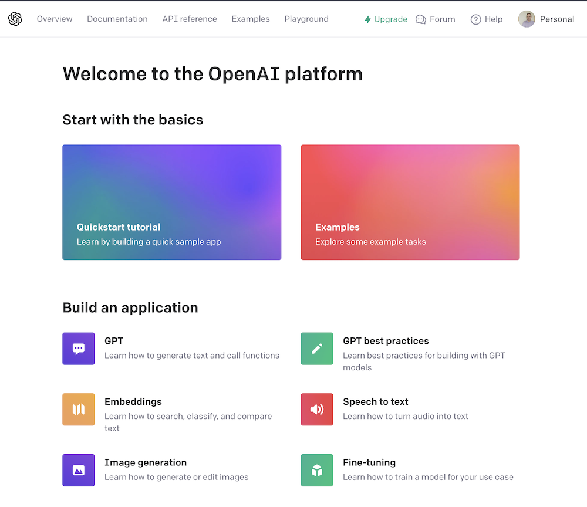
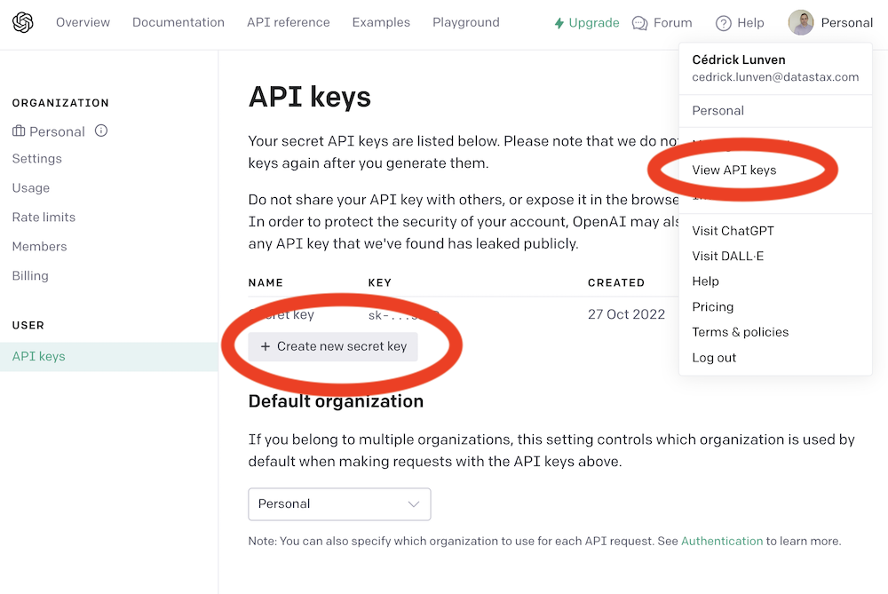

# Photography Site

This sample app demonstrates a photography site by using [`express`](https://www.npmjs.com/package/express), [`mongoose`](https://github.com/Automattic/mongoose) and [`stargate-mongoose`](https://github.com/stargate/stargate-mongoose). 



## 📋 How to

- [01. Create Astra Account](#-1---create-your-datastax-astra-account)
- [02. Create Astra Token](#-2---create-an-astra-token)
- [03. Save your token](#-3---copy-the-token-value-in-your-clipboard)
- [04. Create a Database](#-6---create-destination-database-and-a-keyspace)
- [05. Register to OpenAI](#-8---register-to-openai)
- [06. Setup Project](#-9---setup-project)
- [07. Start the project](#-9---setup-project)


## LAB

> :warning" As of today the application is only available ON ASTRA DEV, please go to [AstraDB](https://dev.cloud.datastax.com/).


#### ✅ `1` - Create your DataStax Astra account

> ℹ️ Account creation tutorial is available in [awesome astra](https://awesome-astra.github.io/docs/pages/astra/create-account/)

_click the image below or go to [https://astra.datastax./com](bit.ly/3QxhO6t)_

<a href="bit.ly/3QxhO6t">

</a>
<br/>


#### ✅ `2` - Create an Astra Token

> ℹ️ Token creation tutorial is available in [awesome astra](https://awesome-astra.github.io/docs/pages/astra/create-token/#c-procedure)

- `Locate `Settings` (#1) in the menu on the left, then `Token Management` (#2)

- Select the role `Organization Administrator` before clicking `[Generate Token]`


The Token is in fact three separate strings: a `Client ID`, a `Client Secret` and the `token` proper. You will need some of these strings to access the database, depending on the type of access you plan. Although the Client ID, strictly speaking, is not a secret, you should regard this whole object as a secret and make sure not to share it inadvertently (e.g. committing it to a Git repository) as it grants access to your databases.

```json
{
  "ClientId": "ROkiiDZdvPOvHRSgoZtyAapp",
  "ClientSecret": "fakedfaked",
  "Token":"AstraCS:fake"
}
```

#### ✅ `3` - Sve the token value in your clipboard


You can also leave the windo open to copy the value in a second.


#### ✅ `4` - Create a Database

in the user interface create a database with the following:

KEYSPACE reate your database and keyspace `photography`


#### ✅ `5` - Register to OpenAI

- Access to [OpenAI platform](https://platform.openai.com/) and register.



- In your profile, go to `View API KEYS`, create a new key and copy the value in your clipboard. 
You have a free trial for a month of so.



```java
EXPORT OPENAI_API_KEY=<key>
```

#### ✅ `6` - Setup project

### Setting up .env file to run against AstraDB
1. Copy the `.env.example` file to `.env` and fill in the values for the environment variables.
2. Set `IS_ASTRA` to `true`
3. Set `OPENAI_API_KEY` to your openAI api key
4. Set `ASTRA_DBID` to your AstraDB database ID
5. Set `ASTRA_REGION` to your AstraDB database region
6. Set `ASTRA_KEYSPACE` to your AstraDB keyspace
7. Set `ASTRA_APPLICATION_TOKEN` to your AstraDB application token


#### ✅ `7` - Run the project


- **Install Python and google-mediapipe**

Make sure you have a local python (3.8 - 3.11) environment [google-mediapipe](https://developers.google.com/mediapipe/solutions/guide) 

```console
pip install mediapipe
```

- **Make sure you have Node.js 17 or higher**

```
node --version
```

- **Build the application**

```
npm install
```

- **Setup the application**

```
npm run seed
```


- Start the application  

```
npm start
```

- Visit `http://127.0.0.1:3000` to see the UI


